// Bật review MD lên nhé, hoặc xem trực tiếp trên github

# Step - Run
> follow these step or connect author.

## `cd` to recent folder
```Bash
cd 140426
```

## Check python version to make sure everything good
```Bash
where python
# or
where python3
# or py3, with `which` instead of `where`
```

## Run `scripts/bash/first_install.sh` or paste it to terminal
```Bash
python -m pip install pandas scikit-learn streamlit matplotlib seaborn joblib imbalanced-learn kagglehub plotly
```

## Install requirements
```Bash
python -m pip  install -r requirements.txt
```

## Download datasets
```Bash
python -u scripts/python/download_data.py
```
- Dataset tải về nằm ở folder `data`, có 2 set, mình sẽ dùng set chính là bank

## Train, validate and tips
```Bash
python -u src/bank/train_bank.py
```
- Trong này Gemini có comments hết ý nghĩa các hàm và thông số theo những require của a rùi. Có một số option anh có vibe code trong này:
    - Trong folder `repports/bank` có chứa 11 đồ thị thường dùng để đánh giá quá trình train, đánh giá model, em thích dùng cái nào để thuyết trình thì dùng. Nếu thấy không cần thiết hoặc nộp code cho thầy thì cứ xoá ra tương ứng trong code là được, hoặc nhờ anh Tài hoặc anh xoá ( anh xoá thì 500k vnd 1 hàm :D )
    - Trong code có sẵn code đưa lời khuyên, cần thay đổi thông số gì để model tốt hơn
    - Trong code có đoạn đánh giá các kỹ thuật sử dụng trong quá trình train, đánh giá tác dụng và so sánh với các kỹ thuật đồng cấp, em có thể xem để tham khảo thêm hoặc fine-tune theo hướng em thích
    - Kết quả trả về có tham số Accuracy và Brier Score, ở dưới có các tham số precision, precall và f1-score, ... em có thể Gemini, GPT, Claude, ... để hiểu rõ hơn nha. Cái nào cần hiểu thì hãy tìm hiểu, còn ko thì bỏ qua hoặc xoá khỏi code cũng được ha
- Các parameters hay các thông số trong code như: train, test, validate, ... e nhớ để ý để fine-tune model
- Model train xong nằm tại folder `model` dạng .pkl (pickle) hen, e có thể tìm hiểu thêm tại sao lại là định dạng pickle, các định dạng lưu model khác, ưu nhược của từng loại, ... thể thêm kiến thức hen

## Run web demo on local IP
- Chạy demo web local bằng lệnh trong `scripts/bash/run_web.sh` hoặc paste vào terminal:
    ```bash  
    streamlit run src/bank/app_bank.py
    ```
- Web tự mở host tại: `http://localhost:8501/`
- Em có thể test ở đây bằng cách thay đổi thông số bên Hồ sơ Khách hàng, và nhấm `TIẾN HÀNH PHÂN TÍCH CHUYÊN SÂU` để show kết quả nha
- Em có thể dọc file data `data/data_bank.csv` để biết cụ thể data như thế nào
- Website được code trong `src/bank/app_bank.py`, em có thể chỉnh sửa UI/UX trong này, sửa text, để tên mình, tên nhóm, etc. ở đây hen, freestyle đê

## Demo report
```bash
$ python -u "/Users/gc-thaitoan/140426/src/bank/train_bank.py"

★★★★★★★★★★★★★★★★★★★★★★★★★★★★★★★★★★★★★★★★★★★★★★★★★★★★★★★★★★★★★★★★★★★★★★
🚀 BẮT ĐẦU HUẤN LUYỆN MODEL - ULTIMATE EDITION V2.2 (AUTO-DIAGNOSTIC)
★★★★★★★★★★★★★★★★★★★★★★★★★★★★★★★★★★★★★★★★★★★★★★★★★★★★★★★★★★★★★★★★★★★★★★

[1/6] 📂 Đang tải và làm sạch dữ liệu Ngân hàng...
      └── Đã xử lý xong: 80000 khách hàng, 17 đặc trưng phân tích.
[2/6] ⚙️  Xây dựng Pipeline tiền xử lý tự động...
[3/6] 🔀 Đang chia tập dữ liệu (Stratified Split)...
[4/6] 🧠 Đang huấn luyện Random Forest Classifier...
[5/6] 📈 ĐANG KẾT XUẤT 11 BIỂU ĐỒ BÁO CÁO CẤP CAO...
      ├── 1-5. Vẽ các biểu đồ cơ bản (Distribution, Heatmap, CM, ROC, PR)...
      ├── 6-7. Vẽ Feature Importance (Gini & Permutation)...
      ├── 8-11. Vẽ các biểu đồ Đánh giá chuyên sâu (Learning, Val, Calibration, Prob Dist)...

[6/6] 💾 Đang đóng gói và lưu trữ mô hình...

════════════════════════════════════════════════════════════════════════════════
🧠 HỆ THỐNG PHÂN TÍCH & CHUẨN ĐOÁN MÔ HÌNH (EXPERT DIAGNOSTIC REPORT)
════════════════════════════════════════════════════════════════════════════════

[I. ĐÁNH GIÁ TÌNH TRẠNG DỮ LIỆU & HUẤN LUYỆN DỰA TRÊN 11 PLOT]
👉 Plot 1 (Phân bổ Target): Dữ liệu có tỷ lệ Churn là 18.0%.
   ❌ Đánh giá: Mất cân bằng NẶNG. Model sẽ có xu hướng 'thiên vị' đoán khách hàng ở lại.
👉 Plot 2 (Heatmap): Phát hiện 0 cặp biến có tương quan rất cao (>0.8).
   ✅ Đánh giá: Các biến độc lập tốt, không bị dính đa cộng tuyến.
👉 Plot 4 & 5 (ROC vs PR Curve): ROC-AUC = 0.852 | PR-AUC = 0.523
   ⚠️ Đánh giá: ROC đang vẽ ra một 'ảo tưởng sức mạnh' do dữ liệu mất cân bằng. Hãy nhìn vào PR-AUC, mô hình thực chất đang gặp khó khăn trong việc duy trì Precision khi cố bắt (Recall) nhóm Rời bỏ.
👉 Plot 8 (Learning Curve): Gap giữa Train và Validation là 0.062
   ✅ Tình trạng: FIT TỐT. Mô hình tổng quát hóa tốt.
👉 Plot 9 (Validation Curve): Độ sâu (max_depth) tối ưu thực sự nằm ở: 13
   💡 Gợi ý: Anh đang set max_depth=15, hãy hạ xuống 13 để bớt overfit!
👉 Plot 11 (Prob Distribution): Điểm giao thoa xác suất tối ưu để tối đa F1-Score là Threshold = 0.52

--------------------------------------------------------------------------------
[II. GIẢI PHẪU KỸ THUẬT PIPELINE ĐÃ SỬ DỤNG (THE ANATOMY)]
1. StratifiedSplit:
   - Tác dụng: Chia Train/Test giữ đúng tỷ lệ 82/18 của khách Rời bỏ.
   - Đồng cấp: RandomSplit (Nguy hiểm vì có thể tập Test không có ai rời bỏ).

2. StandardScaler (Chuẩn hóa số):
   - Tác dụng: Ép dữ liệu về Mean=0, Std=1. Giúp Pipeline chuẩn chỉnh.
   - Đánh đổi (Trade-off): Thực ra thuật toán Tree (Random Forest) KHÔNG CẦN scale. Nó làm mất đi tính trực quan của dữ liệu (ko đọc được số tiền thật sau khi scale).

3. OneHotEncoder (Biến đổi chữ thành số):
   - Tác dụng: Bẻ 'gender' thành 'is_male', 'is_female' (0,1).
   - Đánh đổi: Gây ra 'Lời nguyền số chiều' (Curse of Dimensionality) nếu dùng cho cột có quá nhiều giá trị (VD: mã tỉnh thành). Cây sẽ bị loãng.
   - Kỹ thuật thay thế: Target Encoding (Thay tên tỉnh bằng % tỷ lệ rời bỏ trung bình của tỉnh đó).

4. Random Forest + class_weight='balanced':
   - Tác dụng: Trộn 200 cây quyết định, phạt nặng model nếu đoán sai người rời bỏ.
   - Lợi ích: Rất lỳ đòn, ít bị nhiễu (outliers), chạy song song nhanh.
   - Đồng cấp & Gợi ý thay thế: XGBoost / LightGBM. (Boosting thường đấm gục Random Forest ở Tabular Data với PR-AUC cao hơn 3-5%).

════════════════════════════════════════════════════════════════════════════════
🎯 KẾT QUẢ CUỐI CÙNG & HÀNH ĐỘNG TIẾP THEO
   - Accuracy                : 0.7794
   - Brier Score (Độ sai lệch): 0.1386

⚡ HÀNH ĐỘNG TỨC THÌ: Chuyển Threshold cắt quyết định từ 0.5 xuống 0.52.
>> Report tại ngưỡng tối ưu mới:
              precision    recall  f1-score   support

   Ở lại (0)       0.93      0.81      0.86     13120
  Rời bỏ (1)       0.45      0.70      0.55      2880

    accuracy                           0.79     16000
   macro avg       0.69      0.76      0.70     16000
weighted avg       0.84      0.79      0.81     16000

════════════════════════════════════════════════════════════════════════════════
```

## Đồ thị
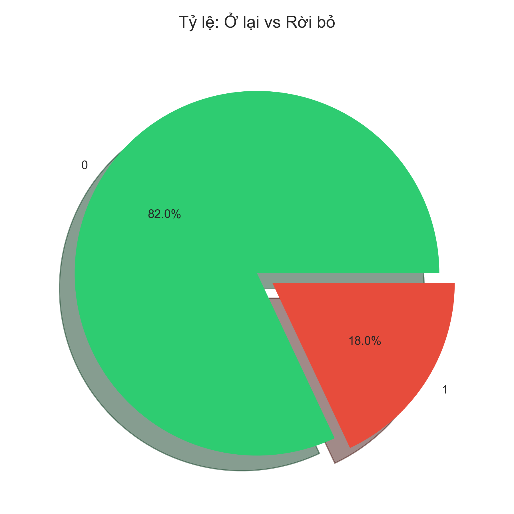
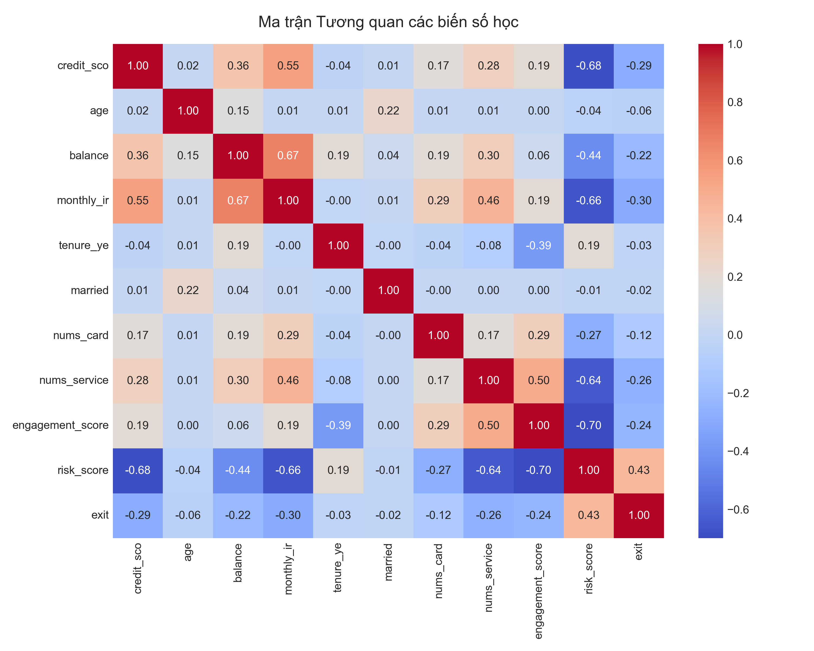
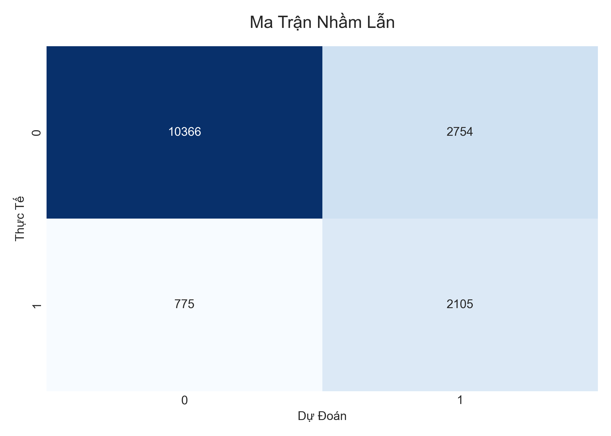
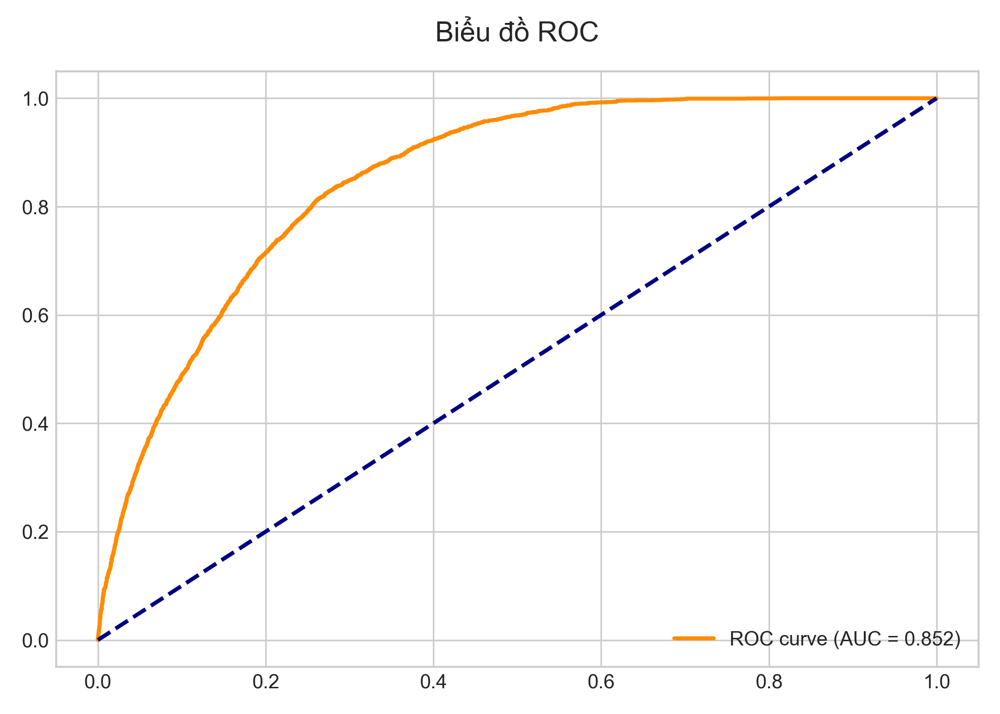
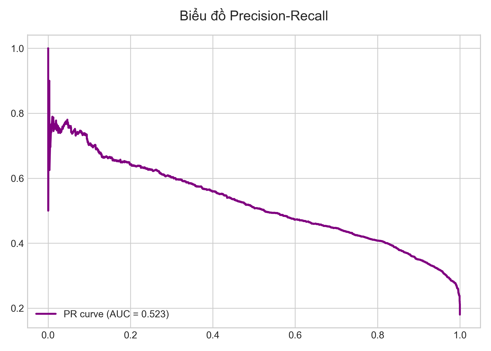
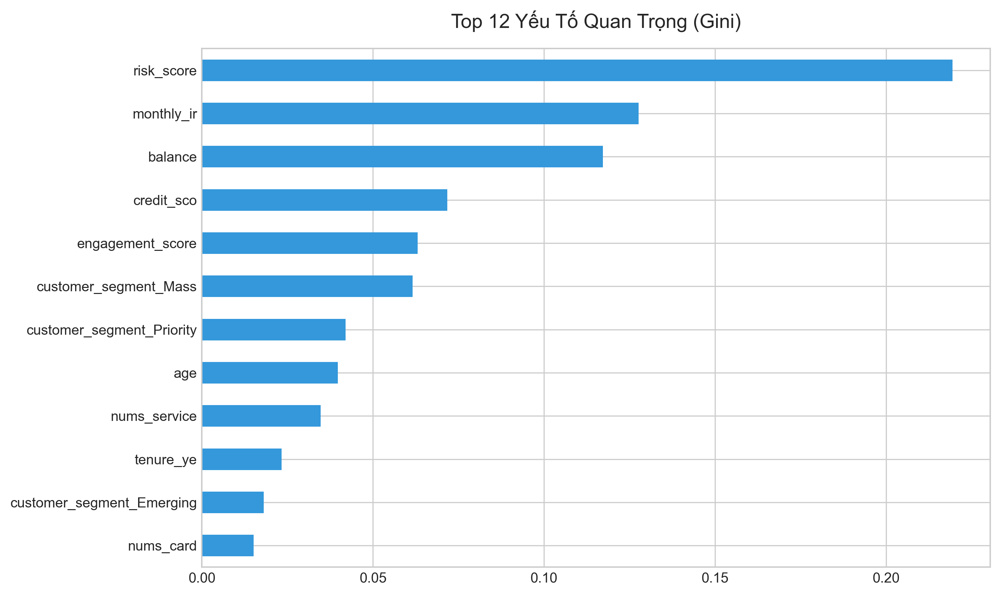
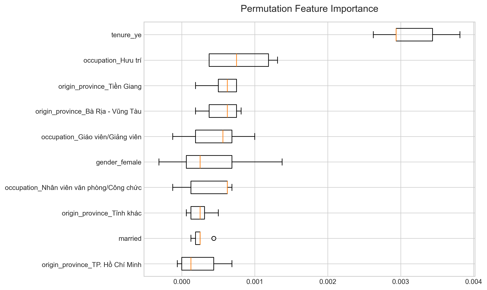
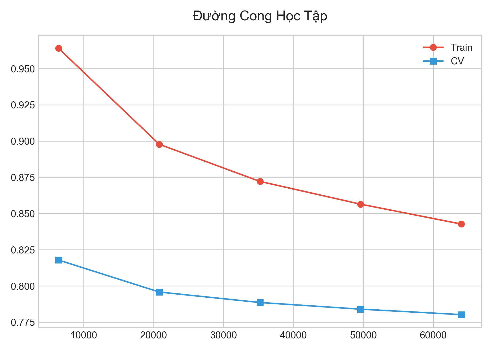
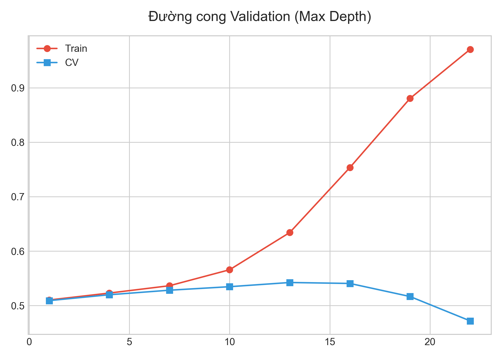
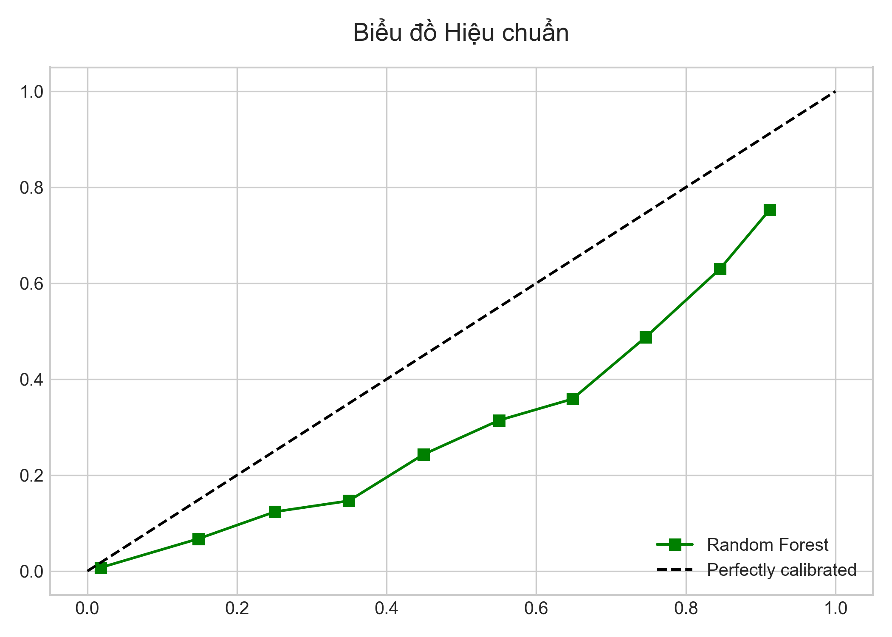
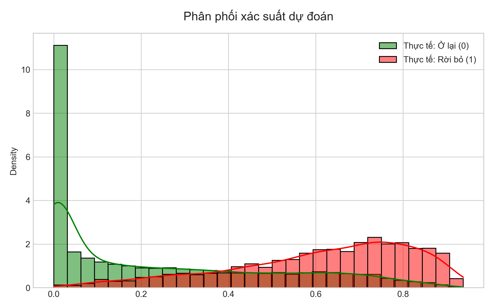

## Bảo trì và phát triển
- ginanightbunny@gmail.com
- conquerstellar.polaris
- 0365725913
- Techcombank 16142516112001